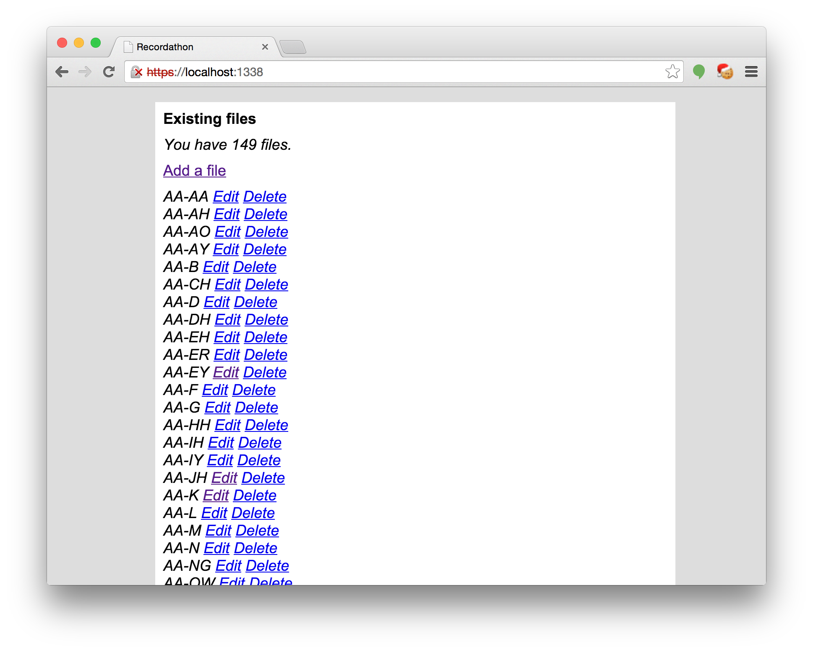
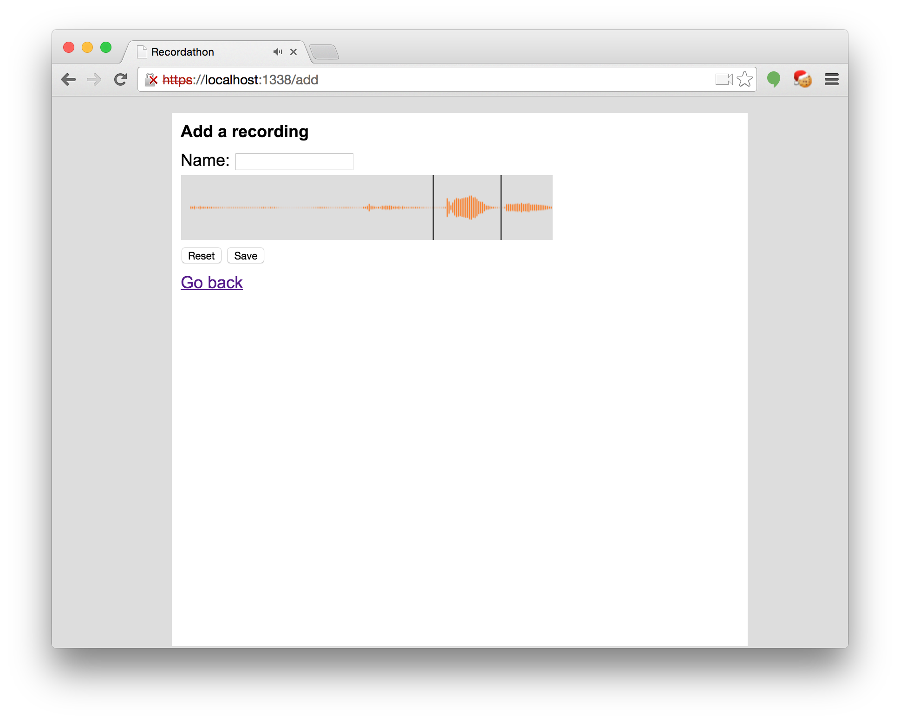

# Recordathon

This is a simple tool for recording many WAV files and quickly cutting them down. It is perfect for recording many parts of speech. Personally, I am using it to record diphones for my [gospeech](https://github.com/unixpickle/gospeech) project.

# Usage

These commands will get recordathon setup and running:

    $ go get github.com/hoisie/mustache
    $ go get github.com/unixpickle/recordathon
    $ go install github.com/unixpickle/recordathon
    $ mkdir ./recordings
    $ recordathon 1337 ./recordings

Now, you may connect to "http://localhost:1337/" and begin recording, editing, playing, and saving files. The files will be saved into the "recordings" directory made in the 4th command.

## Dependencies

I use Mustache to render pages. You can download it with one command, as described above:

    $ go get github.com/hoisie/mustache

# Screenshots

